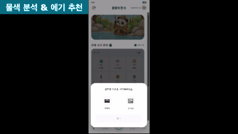

### About Me
* 데이터를 수집하고 관리하는 백엔드를 구축하고, 이를 기반으로 분석까지 연결하고 싶은 개발자 오원석입니다.
* 문제를 단계 별로 분해해 해결하는 과정을 즐기며, 팀원 간 신뢰를 중요하게 생각합니다.
* 취미 : 러닝, 산책, 축구, 헬스

  

  

---

### Languages

**LLM (Fine tuning)**  
&nbsp;
&nbsp;

**Computer Vision**  
&nbsp;

**Backend / DB**  
&nbsp;
&nbsp;

**Data / ML**  

**UI**  
&nbsp;

---

## Project

### 1) 이미지 기반 낚시 환경 분석과 음성 기반 조행 기록을 결합한 스마트 낚시 플랫폼
YOLO 기반 모바일 실시간 바닷물 탐지와 LoRA Fine-tuning·RAG 기반 sLLM을 결합해, 바다,날씨 환경에 맞는 미끼 상품 추천
* 
  

  

* Since : 2025.10.24~ 2026.01.10
